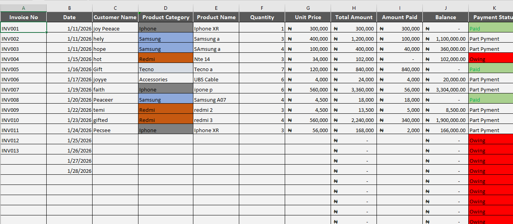
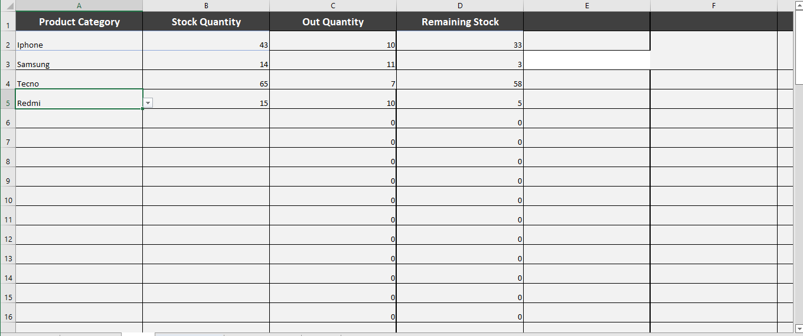
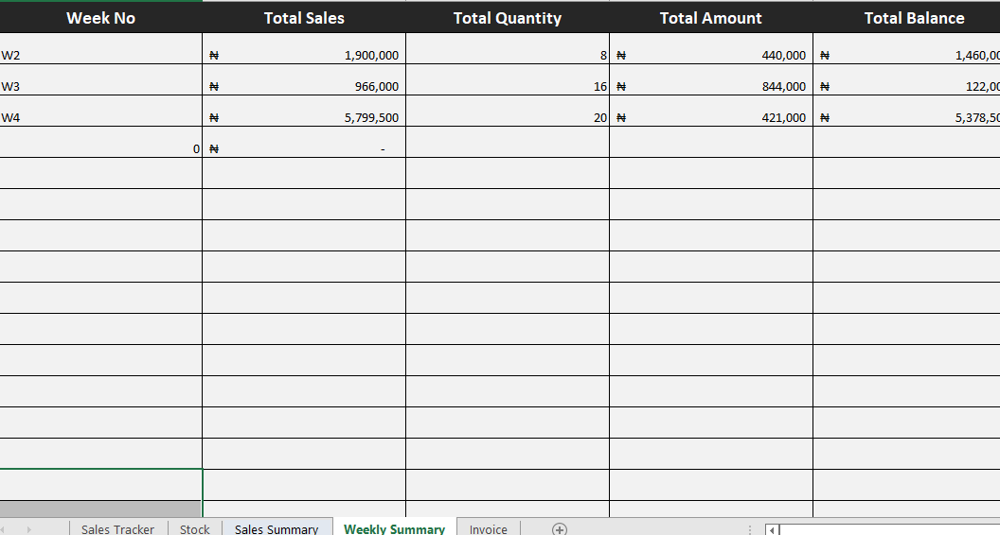
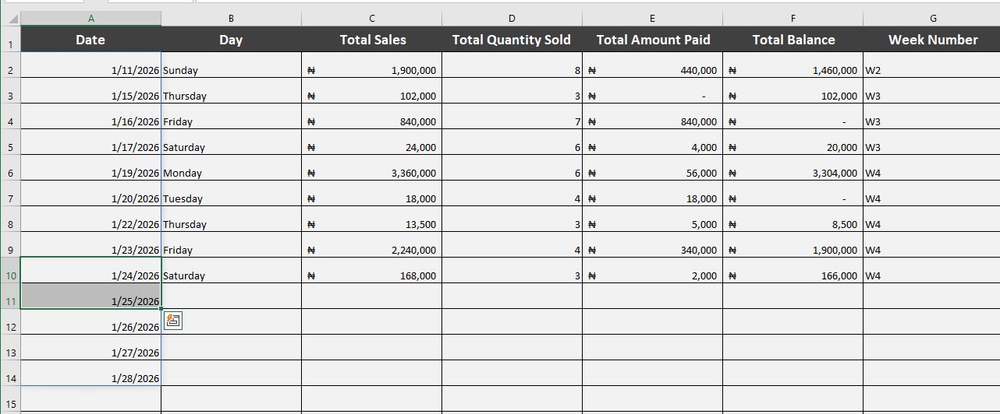
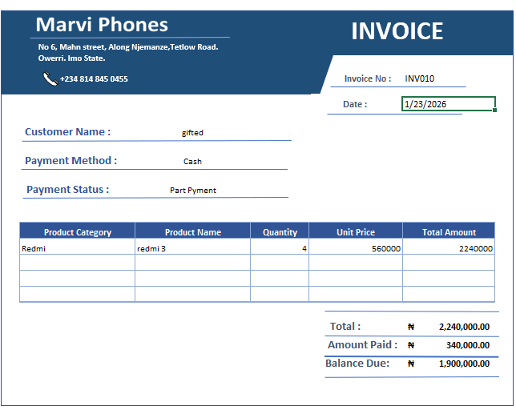

# Automated-Sales-Management-System
A fully automated Sales Management System built in Excel tracks sales, updates inventory, generates invoices, and summarizes performance in real time.

# Overview

Small businesses don’t just need effort. They need systems.

This project is a fully automated Sales Management System built entirely in Excel designed to replace manual tracking with a structured, self-updating workflow that handles everything from sales entry to performance reporting.

# Problem Statement

Small businesses often manage sales, inventory, and invoicing manually which leaves room for errors, delays, and blind spots. This system was built to eliminate that gap.

# What It Does

 • Records and tracks sales transactions
 
 • Automatically updates inventory after every sale
 
 • Generates invoices without manual input
 
 • Summarizes business performance in real time

# Tools Used

 • Microsoft Excel — automation, formulas, data structure, invoice generation

# Key Highlights

# Sales Tracking
Every transaction is recorded and organized in a structured format, making it easy to review history and spot patterns.

# Inventory Automation
Stock levels update automatically as sales are made no manual counting, no guesswork.

# Real-Time Performance Summary
A summary view pulls key metrics together so business owners can see exactly how they are doing at any point.

# Invoice Generation
Invoices are generated directly from sales data, saving time and reducing errors.

# What I Learned

This project deepened my understanding of data structure, business process optimization, and how Excel can go far beyond basic spreadsheets when used with intention.

# Tracker Preview

You can connect with me [Linkedin](http://linkedin.com/in/gifted-ajamu)

Connect
